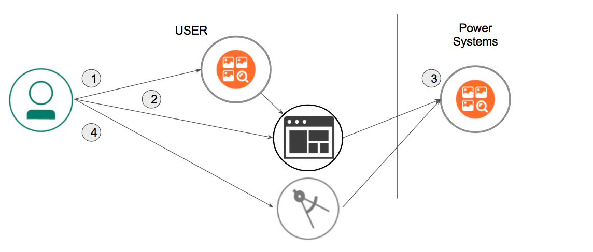
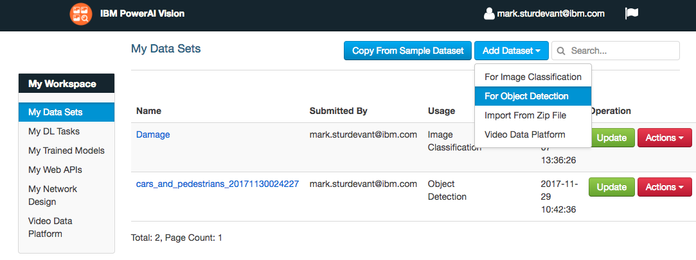
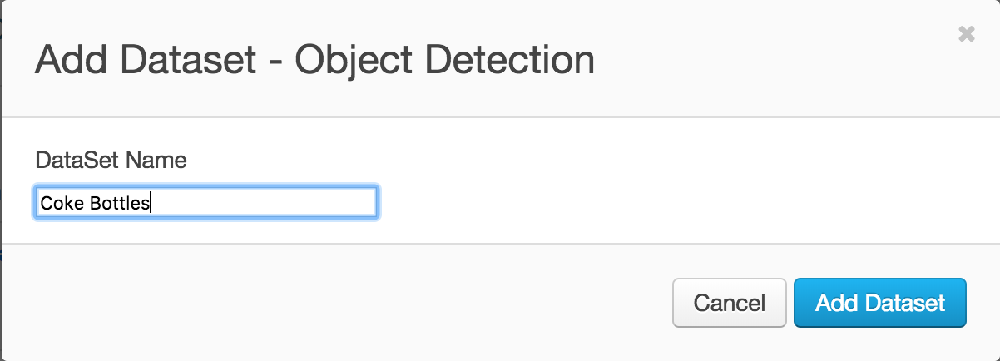
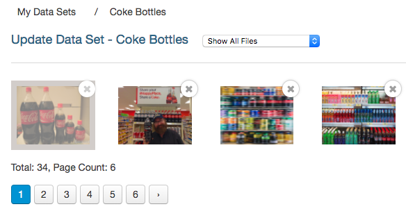
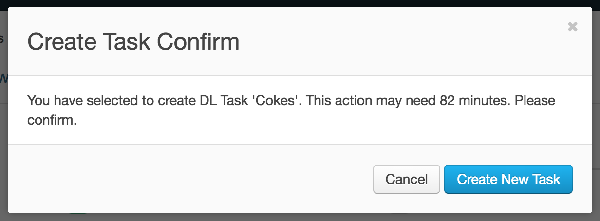
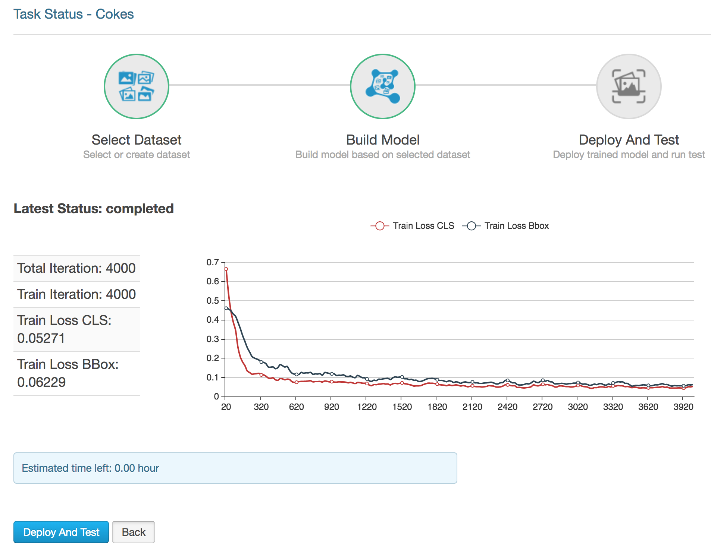

*Read this in other languages: [日本語](README-ja.md).*

# Object detection with PowerAI Vision

In this Code Pattern, we will use PowerAI Vision Object Detection
to detect and label objects, within an image, based on customized
training.

> This example can easily be customized with your own datasets.

An example dataset has been provided with images of Coca-Cola bottles.
Once we train and deploy a model, we'll have a REST endpoint
that allows us locate and count Coke bottles in an image.

Deep learning training will be used to create a model for
Object Detection. With PowerAI Vision, deep learning training is
as easy as a few clicks of a mouse. Once the task has completed,
the model can be deployed with another click.

PowerAI Vision presents REST APIs for inference operations.
Object detection with your custom model can be used from any REST
client and can also be tested in the PowerAI Vision UI.

When the reader has completed this Code Pattern, they will understand how to:

* Create a dataset for object detection with PowerAI Vision
* Train and deploy a model based on the dataset
* Test the model via REST calls



## Flow

1. User uploads images to create a PowerAI Vision dataset
1. User labels objects in the image dataset prior to training
1. The model is trained, deployed and tested in PowerAI Vision
1. User can detect objects in images using a REST client

## Included components

* [IBM Power Systems](https://www.ibm.com/it-infrastructure/power): A server built with open technologies and designed for mission-critical applications.
* [IBM PowerAI](https://www.ibm.com/us-en/marketplace/deep-learning-platform): A software platform that makes deep learning, machine learning, and AI more accessible and better performing.
* [IBM PowerAI Technology Preview](https://developer.ibm.com/linuxonpower/deep-learning-powerai/technology-previews/powerai-vision/): A complete ecosystem for labeling datasets, training, and deploying deep learning models for computer vision.

## Featured technologies
* [Artificial Intelligence](https://developer.ibm.com/technologies/artificial-intelligence/): Create apps that accelerate, enhance, and scale the human expertise.
* [Node.js](https://nodejs.org/): An open-source JavaScript run-time environment for executing server-side JavaScript code.

# Watch the Video
[](https://www.youtube.com/watch?v=xoLcXQs4SP4)

# Prerequisites

*This Code Pattern was built with the PowerAI Vision Technology Preview v3.0.*

* To try the preview using the `SuperVessel` cloud, login or register [here](https://ny1.ptopenlab.com/AIVision).

* If you have Power Systems and want to download an installer to deploy
the preview on your own systems, register [here](https://www-01.ibm.com/marketing/iwm/iwm/web/preLogin.do?source=mrs-eibmpair).

> NOTE: The steps and examples in this README assume you are using SuperVessel. For example, some URLs use `ny1.ptopenlab.com`.

# Steps

1. [Clone the repo](#1-clone-the-repo)
2. [Login to PowerAI Vision](#2-login-to-powerai-vision)
3. [Create a dataset](#3-create-a-dataset)
4. [Create tags and label objects](#4-create-tags-and-label-objects)
5. [Create a DL task](#5-create-a-dl-task)
6. [Deploy and test](#6-deploy-and-test)
7. [Run the app](#7-run-the-app)

### 1. Clone the repo

Clone the `powerai-vision-object-detection` locally. In a terminal, run:

```
git clone https://github.com/IBM/powerai-vision-object-detection
```

### 2. Login to PowerAI Vision

If you are using SuperVessel, login here: https://ny1.ptopenlab.com/AIVision/index.html

### 3. Create a dataset

PowerAI Vision Object Detection discovers and labels objects within an image, enabling users and developers to count instances of objects within an image based on customized training.

To create a new dataset for object detection training:

* From the `My Data Sets` view, click the `Add Dataset` button and then select `For Object Detection` in the pull-down.

  

* Provide a DataSet Name and click `Add Dataset`.

  

* Upload one or more images using drag-and-drop or `Select some`. You can use [powerai-vision-object-detection/data/coke_bottles.zip](https://github.com/IBM/powerai-vision-object-detection/raw/master/data/coke_bottles.zip) from your cloned repo to upload many at once.

  

  > Note: If you are using your own zip file and do not see file thumbnails after the upload, then the upload failed. Use lowercase file names without special characters or spaces. You can also upload individual files or multi-select several at a time to determine which file caused the upload to fail.

### 4. Create tags and label objects

* Create one or more tags by clicking the `+` icon to add a new tag. Each tag will represent the training objects within the image based on specific use cases (e.g., "Coca-Cola", "Diet Coke", "Coke Zero").

* Label the objects in each image by selecting a tag and dragging a bounding box around the object in the image. Press `Save` when done with each image.

* Repeat this process for all tags and all images.

  > Note: You can import [powerai-vision-object-detection/data/coke_bottles_exported.zip](https://github.com/IBM/powerai-vision-object-detection/raw/master/data/coke_bottles_exported.zip) which was already labeled and exported.

  

  > Tip: Use the `Only Show Unlabeled Files` pull-down to help you see when you are done.

* You can use the `Data Augmentation` button to expand your dataset. Label the original images first and be sure to consider whether mirror images (horizontal or vertical) are appropriate for your use case. If you use data augmentation, a new expanded dataset will be created for you.

* Click `Export As Zip File` to save a copy of your work. Now that you've spent some time labeling, this zip will let you start over without losing your work.

### 5. Create a DL task

* Click on `My DL Tasks` under My Workspace and then click the `Create New Task` button. Click on `Object Detection`.

* Give the Object Detector a name and make sure your dataset is selected, then click `Build Model`.

  

* A confirmation dialog will give you a time estimate.  Click `Create New Task` to get it started.

  

### 6. Deploy and test

* When the model is built, click on `Deploy and Test`.

  

* Test your model in the PowerAI Vision UI. Use `Select some` to choose a test image. The result shows you how many objects were detected and the image is shown with bounding boxes, labels and confidence scores.

  

* From a command-line, you can test your deployed REST endpoint using an image file and the `curl` command. Notice the output JSON shows multiple bottles were detected and provides the confidence, label and location for each of them.
  > Warning: this example used `--insecure` for convenience.

  ```bash
  $ curl --insecure -i -F files=@coke_bottle_23.png https://ny1.ptopenlab.com/AIVision/api/dlapis/9f9d6787-0183-4a1b-be49-751b6ca16724
  HTTP/1.1 100 Continue

  HTTP/1.1 200 OK
  Server: nginx/1.9.13
  Date: Thu, 14 Dec 2017 21:58:26 GMT
  Content-Type: application/json
  Content-Length: 508
  Connection: keep-alive
  Access-Control-Allow-Origin: *
  Access-Control-Allow-Headers: origin, content-type, accept, authorization
  Access-Control-Allow-Credentials: true
  Access-Control-Allow-Methods: GET, POST, PUT, DELETE, OPTIONS, HEAD
  Access-Control-Allow-Origin: *

  { "classified" : [ { "confidence" : 0.9986369013786316 , "ymax" : 578 , "label" : "coca-cola" , "xmax" : 755 , "xmin" : 588 , "ymin" : 29} , { "confidence" : 0.9954010248184204 , "ymax" : 592 , "label" : "coca-cola" , "xmax" : 601 , "xmin" : 437 , "ymin" : 10} , { "confidence" : 0.8161203265190125 , "ymax" : 567 , "label" : "coca-cola" , "xmax" : 426 , "xmin" : 259 , "ymin" : 17}] , "imageUrl" : "http://ny1.ptopenlab.com:443/AIVision/temp/5a26dd3b-d8ba-4e01-8b93-5a43f28e97c7.png" , "result" : "success"}
  ```

### 7. Run the app

An example web app demonstrates how to upload a picture, use the trained and deployed model, and display the detected objects by drawing bounding boxes and labels on the image. The functionality is similar to the above testing, but the code is provided for you to customize.

Use the [Deploy to IBM Cloud](#deploy-to-ibm-cloud) button **OR** [Run locally](#run-locally).

#### Deploy to IBM Cloud
[](https://cloud.ibm.com/devops/setup/deploy?repository=https://github.com/IBM/powerai-vision-object-detection)

1. Press the above `Deploy to IBM Cloud` button, click `Create+` to create an *IBM Cloud API Key* and then click on `Deploy`.

1. In Toolchains, click on Delivery Pipeline to watch while the app is deployed.

1. Use the IBM Cloud dashboard to manage the app. The app is named `powerai-vision-object-detection` with a unique suffix.

1. Add your PowerAI Vision API endpoint:
   * Click on the app in the IBM Cloud dashboard.
   * Select `Runtime` in the sidebar.
   * Hit `Environment variables` in the middle button bar.
   * Hit the `Add` button.
   * Add the name `POWERAI_VISION_WEB_API_URL` and set the value to the web API that you deployed (above).
   * Hit the `Save` button. The app will restart automatically.
   * Click on `Visit App URL` to use the app.

#### Run locally

Use your cloned repo to build and run the web app.

> NOTE: These steps are only needed when running locally instead of using the ``Deploy to IBM Cloud`` button.

* Copy the env.sample to .env. Edit the file to set the URL to point to the web API that you deployed (above).

* Assuming you have pre-installed [Node.js](https://nodejs.org/en/download/) and [npm](https://docs.npmjs.com/getting-started/installing-node), run the following commands:

  ```bash
  cd powerai-vision-object-detection
  npm install
  npm start
  ```

* Use a browser to go to the web UI. The default URL is http://localhost:8081.

#### Use the web app

* Use the `Choose File` button to choose a file. On a phone this should give you an option to use your camera. On a laptop, you choose an image file (JPG or PNG).

* Press the `Upload File` button to send the image to your web API and render the results.

  

* The UI will show an error message, if you did not configure your POWERAI_VISION_WEB_API_URL or if your API is not deployed (in SuperVessel you can quickly redeploy every hour).

# Links

* [Demo on Youtube](https://www.youtube.com/watch?v=xoLcXQs4SP4): Watch the video
* [Object Detection](https://en.wikipedia.org/wiki/Object_detection): Object detection on Wikipedia
* [PowerAI Vision](https://developer.ibm.com/linuxonpower/deep-learning-powerai/technology-previews/powerai-vision/): Deep Learning and PowerAI Development
* [TensorFlow Object Detection](https://research.googleblog.com/2017/06/supercharge-your-computer-vision-models.html): Supercharge your Computer Vision models with the TensorFlow Object Detection API
* [AI Article](https://www.entrepreneur.com/article/283990): Can Artificial Intelligence Identify Pictures Better than Humans?
* [From the developers](https://developer.ibm.com/linuxonpower/2017/08/30/ibm-powerai-vision-speeds-transfer-learning-greater-accuracy-real-world-example/): IBM PowerAI Vision speeds transfer learning with greater accuracy -- a real world example

# Learn more

* **Artificial Intelligence Code Patterns**: Enjoyed this Code Pattern? Check out our other [AI Code Patterns](https://developer.ibm.com/technologies/artificial-intelligence/).
* **AI and Data Code Pattern Playlist**: Bookmark our [playlist](https://www.youtube.com/playlist?list=PLzUbsvIyrNfknNewObx5N7uGZ5FKH0Fde) with all of our Code Pattern videos
* **PowerAI**: Get started or get scaling, faster, with a software distribution for machine learning running on the Enterprise Platform for AI: [IBM Power Systems](https://www.ibm.com/ms-en/marketplace/deep-learning-platform)

# License

This code pattern is licensed under the Apache License, Version 2. Separate third-party code objects invoked within this code pattern are licensed by their respective providers pursuant to their own separate licenses. Contributions are subject to the [Developer Certificate of Origin, Version 1.1](https://developercertificate.org/) and the [Apache License, Version 2](https://www.apache.org/licenses/LICENSE-2.0.txt).

[Apache License FAQ](https://www.apache.org/foundation/license-faq.html#WhatDoesItMEAN)
