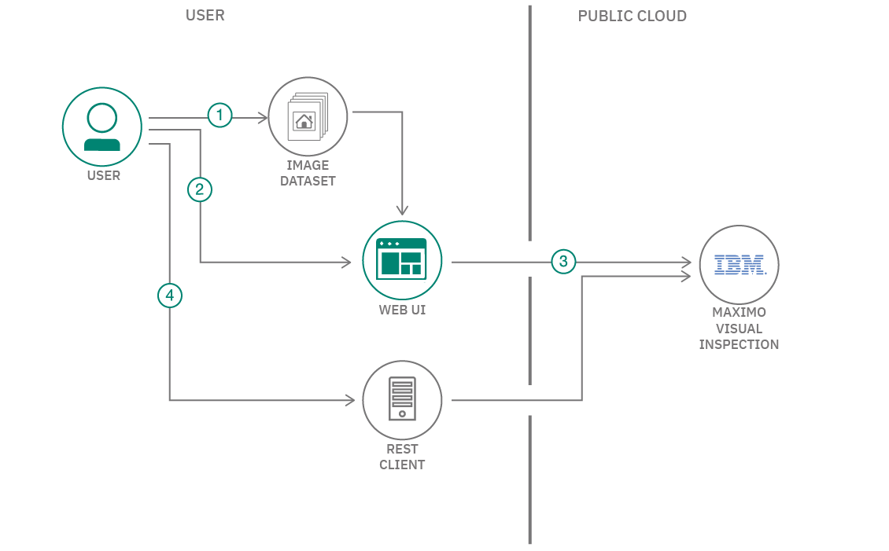
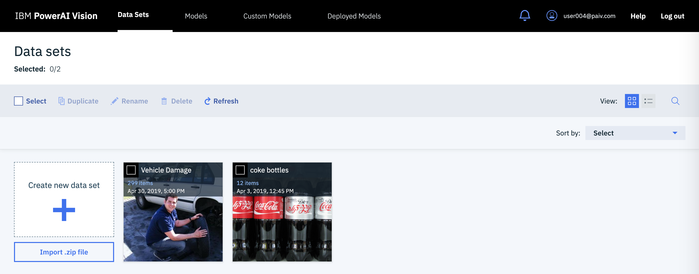
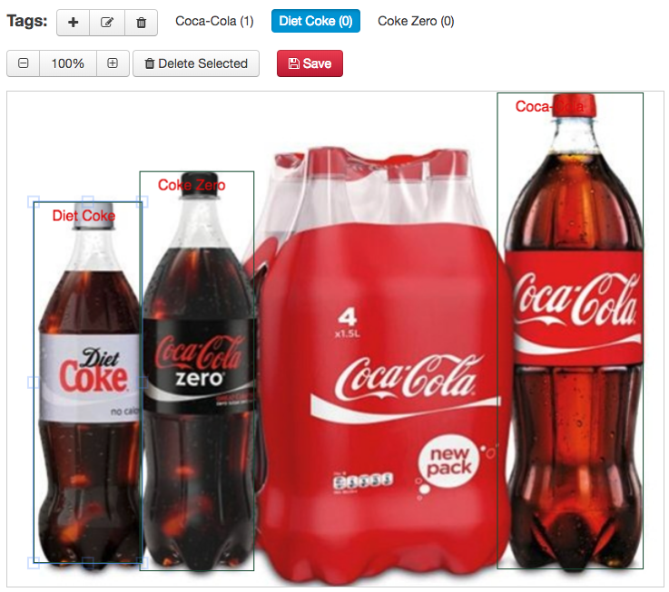
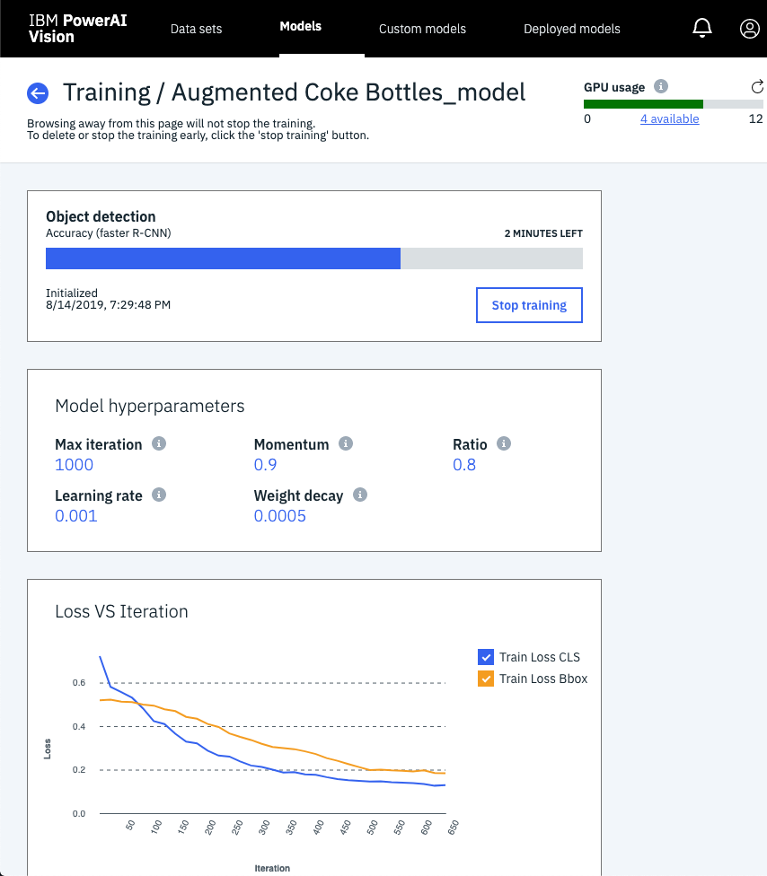
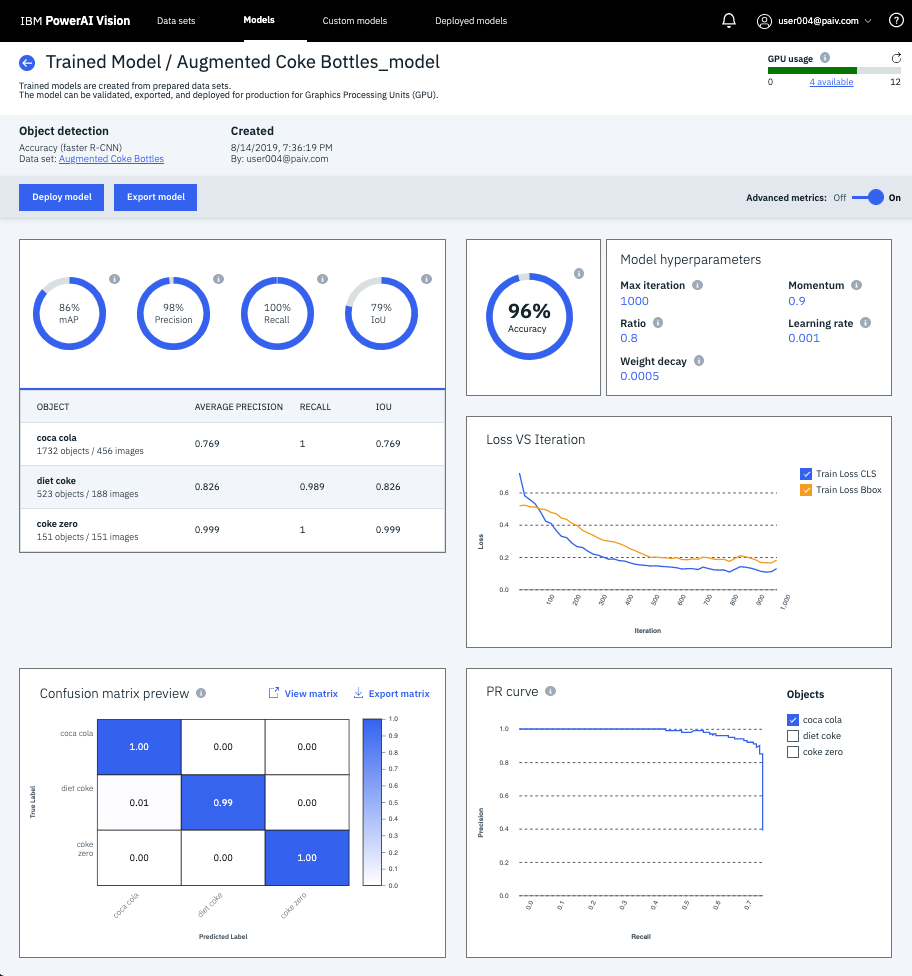
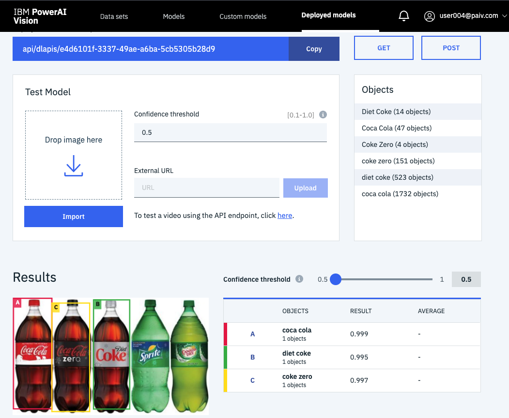
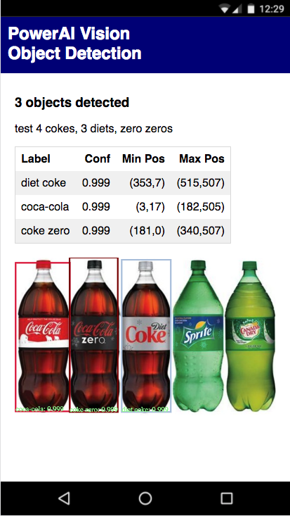

# WARNING: This repository is no longer maintained

> This repository will not be updated. The repository will be kept available in read-only mode.

# Object detection with Maximo Visual Inspection (Formerly PowerAI Vision)

> Note: This repo has been updated to use Maximo Visual Inspection(Formerly PowerAI Vision).
**Same product, new name. Previously called PowerAI Vision.**

In this code pattern, we will use Maximo Visual Inspection
to detect and label objects, within an image, based on customized
training.

> Note: This example can easily be customized with your own data sets.

An example data set has been provided with images of Coca-Cola bottles.
Once we train and deploy a model, we'll have a REST endpoint
that allows us locate and count Coke bottles in an image.

Deep learning training will be used to create a model for
Object Detection. With Maximo Visual Inspection, deep learning training is
as easy as a few clicks of a mouse. Once the task has completed,
the model can be deployed with another click.

Maximo Visual Inspection presents REST APIs for inference operations.
Object detection with your custom model can be used from any REST
client and can also be tested in the Maximo Visual Inspection UI.

When the reader has completed this code pattern, they will understand how to:

* Create a data set for object detection with Maximo Visual Inspection (Formerly PowerAI Vision)
* Train and deploy a model based on the data set
* Test the model via REST calls



## Flow

1. User uploads images to create a Maximo Visual Inspection data set
1. User labels objects in the image data set prior to training
1. The model is trained, deployed and tested in Maximo Visual Inspection web interface
1. User can detect objects in images using a REST client

## Watch the Video

[](https://www.youtube.com/watch?v=xoLcXQs4SP4)

## Prerequisites

This code pattern requires Maximo Visual Inspection.

Go [here](https://www.ibm.com/support/pages/ibm-maximo-visual-inspection)
to learn more about trial access (Scroll down to the `Give it a try` section)..

> Note: *This code pattern was tested with Maximo Visual Inspection 1.3.0*

## Steps

1. [Clone the repo](#1-clone-the-repo)
2. [Login to Maximo Visual Inspection](#2-login-to-Maximo-visual-Inspection)
3. [Create a data set](#3-create-a-data-set)
4. [Label the objects](#4-label-the-objects)
5. [Train the model](#5-train-the-model)
6. [Deploy and test](#6-deploy-and-test)
7. [Run the app](#7-run-the-app)

### 1. Clone the repo

Clone the `powerai-vision-object-detection` locally. In a terminal, run:

```bash
git clone https://github.com/IBM/powerai-vision-object-detection
```

### 2. Login to Maximo Visual Inspection

Use your browser to access the Maximo Visual Inspection web UI for steps 3-6.

> Note: The images below show the old PowerAI Vision UI, but the interface is nearly the same except the new product name.

### 3. Create a data set

Maximo Visual Inspection Object Detection discovers and labels objects within an image, enabling users and developers to count instances of objects within an
image based on customized training.

To create a new data set for object detection training:

* Use the `Data Sets` tab and click on the `Create new data set` card.

  

* Provide a data set name and click `Create`.

* A new data set card will appear. Click on the new card.

* Upload one or more images using drag-and-drop or `Import files`. You can use `data/coke_bottles.zip` from your cloned repo to upload many at once.

### 4. Label the objects

* Create new object labels for the data set by clicking `+ Add object` under the `Objects` pulldown in the sidebar. To add multiple object labels, enter one label, click `Add`, then enter the next until you are done and then hit `OK`. For our example data set, add "Coca Cola", "Diet Coke", and "Coke Zero".

* Label the objects in each image by clicking on the image card and hitting `Label objects`. Then choose `Box` from the bottom left. Select the label to use on the left and then click and drag to draw a bounding box around each object of that type in the image.

Press `Save` when done with each image.

* Repeat this process for all labels and all images.

  > Note: You can import [powerai-vision-object-detection/data/coke_bottles_exported.zip](https://github.com/IBM/powerai-vision-object-detection/raw/master/data/coke_bottles_exported.zip) which was already labeled and exported.

  

  > Tip: Use the `Unlabeled` object filter to help you see when you are done.

* You can use the `Augment data` button to expand your data set. Label the original images first and be sure to consider whether flipped images (horizontal or vertical) are appropriate for your use case. If you use data augmentation, a new expanded data set will be created for you.

* Click `Export data set` to save a copy of your work. Now that you've spent some time labeling, this zip will let you start over without losing your work.

### 5. Train the model

* Open your augmented data set and click `Train model` (just use the original if you did not augment).

* Be sure to select `Object detection` as the `Type of training`.

* Select a model for speed or accuracy.

* Take a look at the `Advanced options`. You can keep the defaults, but if you'd like to speed things up, try reducing the `Max iteration`.

* Click the `Train` button.

  

* When the training is done, click `Model details` to see some metrics and graphical description of the model accuracy.

  

### 6. Deploy and test

* Click `Deploy model` and `Deploy` to make the model available via an API endpoint.

* `Copy` the API endpoint from your deployed model. Use this to test with `curl` (below) and to set the `POWERAI_VISION_WEB_API_URL` for the web app (in step 7).

* Test your model in the Maximo Visual Inspection UI. Use `Import` to choose a test image. The result shows you the image with bounding boxes around the detected objects and a table showing the labels and confidence scores.

  

* From a command-line, you can test your deployed REST endpoint using an image file and the `curl` command. Notice the output JSON shows multiple bottles were detected and provides the confidence, label and location for each of them.

* Make sure to unzip the `test_set.zip` file in the `data` directory.

  > Warning: this example used `--insecure` for convenience.

  ```bash
  $ cd data/test_set
  $ curl --compressed --insecure -i -F files=@coke_bottle_23.png https://host-or-ip-addr/powerai-vision-ny/api/dlapis/e4d6101f-3337-49ae-a6ba-5cb5305b28d9

  My request looked like the following:
  
  curl --compressed --insecure -i -F files=@coke_bottle_23.png https://vision-p.aus.stglabs.ibm.com/visual-inspection-v130-prod/api/dlapis/6e0a7-d9da-4314-a350-d9a2c0f2b

  HTTP/2 200
  server: nginx/1.15.6
  date: Tue, 01 Dec 2020 17:22:14 GMT
  content-type: application/json
  vary: Accept-Encoding
  x-powered-by: Servlet/3.1
  access-control-allow-origin: *
  access-control-allow-headers: X-Auth-Token, origin, content-type, accept, authorization
  access-control-allow-credentials: true
  access-control-allow-methods: GET, POST, PUT, DELETE, OPTIONS, HEAD
  content-language: en
  x-frame-options: SAMEORIGIN
  x-content-type-options: nosniff
  x-xss-protection: 1; mode=block
  strict-transport-security: max-age=15724800; includeSubDomains
  content-encoding: gzip

  {"webAPIId":"6e3480a7-d9da-4314-a350-d9aac22c0f2b","imageUrl":"http://vision-v130-prod-service:9080/vision-v130-prod-api/uploads/temp/6e3480a7-d9da-4314-a350-d9aac22c0f2b/c62cc7dc-dbc2-448d-85e8-41485a2c17f5.png","imageMd5":"ea1f6444fa7dabeda7049d426699879c","classified":[{"label":"Coke","confidence":0.995542585849762,"xmin":601,"ymin":29,"xmax":763,"ymax":546,"attr":[{}]},{"label":"Coke","confidence":0.982393741607666,"xmin":447,"ymin":40,"xmax":593,"ymax":572,"attr":[{}]},{"label":"Coke","confidence":0.8604443669319153,"xmin":67,"ymin":18,"xmax":245,"ymax":604,"attr":[{}]},{"label":"Coke","confidence":0.8339363932609558,"xmin":269,"ymin":32,"xmax":422,"ymax":589,"attr":[{}]}],"result":"success"}
  ```

### 7. Run the app

An example web app demonstrates how to upload a picture, use the trained and deployed model, and display the detected objects by drawing bounding boxes and labels on the image. The functionality is similar to the above testing, but the code is provided for you to customize.

Use the [Deploy to IBM Cloud](#deploy-to-ibm-cloud) button **OR** [Run locally](#run-locally).

#### Deploy to IBM Cloud

[](https://cloud.ibm.com/devops/setup/deploy?repository=https://github.com/IBM/powerai-vision-object-detection)

1. Press the above `Deploy to IBM Cloud` button, click `Create+` to create an *IBM Cloud API Key* and then click on `Deploy`.

1. In Toolchains, click on `Delivery Pipeline` to watch while the app is deployed.

1. Use the IBM Cloud dashboard to manage the app. The app is named `powerai-vision-object-detection` with a unique suffix.

1. Add your PowerAI Vision API endpoint:
   * Click on the app in the IBM Cloud dashboard.
   * Select `Runtime` in the sidebar.
   * Hit `Environment variables` in the middle button bar.
   * Hit the `Add` button.
   * Add the name `POWERAI_VISION_WEB_API_URL` and set the value to the web API that you deployed (above).
   * Hit the `Save` button. The app will restart automatically.
   * Click on `Visit App URL` to use the app.

#### Run locally

Use your cloned repo to build and run the web app.

> Note: These steps are only needed when running locally instead of using the ``Deploy to IBM Cloud`` button.

* Copy the env.sample to .env. Edit the file to set the URL to point to the web API that you deployed (above).

* Assuming you have pre-installed [Node.js](https://nodejs.org/en/download/) and [npm](https://docs.npmjs.com/getting-started/installing-node), run the following commands:

  ```bash
  cd powerai-vision-object-detection
  npm install
  npm start
  ```

* Use a browser to go to the web UI. The default URL is `http://localhost:8081`.

#### Use the web app

* Use the `Choose File` button to choose a file. On a phone this should give you an option to use your camera. On a laptop, you choose an image file (JPG or PNG).

* Press the `Upload File` button to send the image to your web API and render the results.

  

* The UI will show an error message, if you did not configure your POWERAI_VISION_WEB_API_URL or if your API is not deployed (in SuperVessel you can quickly redeploy every hour).

## Links

* [Maximo Visual Inspection Learning Path](https://developer.ibm.com/technologies/vision/series/learning-path-powerai-vision/): From computer vision basics to creating your own apps.
* [Demo on YouTube](https://www.youtube.com/watch?v=xoLcXQs4SP4): Watch the video
* [Object Detection](https://en.wikipedia.org/wiki/Object_detection): Object detection on Wikipedia
* [TensorFlow Object Detection](https://ai.googleblog.com/2017/06/supercharge-your-computer-vision-models.html): Supercharge your Computer Vision models with the TensorFlow Object Detection API
* [AI Article](https://www.entrepreneur.com/article/283990): Can Artificial Intelligence Identify Pictures Better than Humans?
* [From the developers](https://developer.ibm.com/linuxonpower/2017/08/30/ibm-powerai-vision-speeds-transfer-learning-greater-accuracy-real-world-example/): IBM PowerAI Vision speeds transfer learning with greater accuracy -- a real world example

## Learn more

* **Artificial Intelligence code patterns**: Enjoyed this code pattern? Check out our other [AI code patterns](https://developer.ibm.com/technologies/artificial-intelligence/).
* **AI and Data code pattern playlist**: Bookmark our [playlist](https://www.youtube.com/playlist?list=PLzUbsvIyrNfknNewObx5N7uGZ5FKH0Fde) with all of our code pattern videos
* **PowerAI**: Get started or get scaling, faster, with a software distribution for machine learning running on the Enterprise Platform for AI: [IBM Power Systems](https://www.ibm.com/ms-en/marketplace/deep-learning-platform)

## License

This code pattern is licensed under the Apache License, Version 2. Separate third-party code objects invoked within this code pattern are licensed by their respective providers pursuant to their own separate licenses. Contributions are subject to the [Developer Certificate of Origin, Version 1.1](https://developercertificate.org/) and the [Apache License, Version 2](https://www.apache.org/licenses/LICENSE-2.0.txt).

[Apache License FAQ](https://www.apache.org/foundation/license-faq.html#WhatDoesItMEAN)
